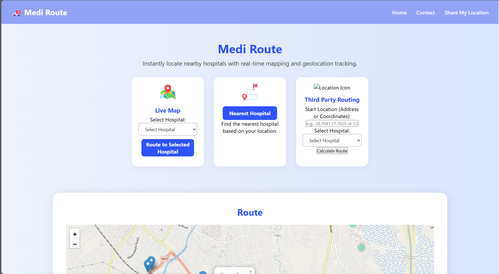
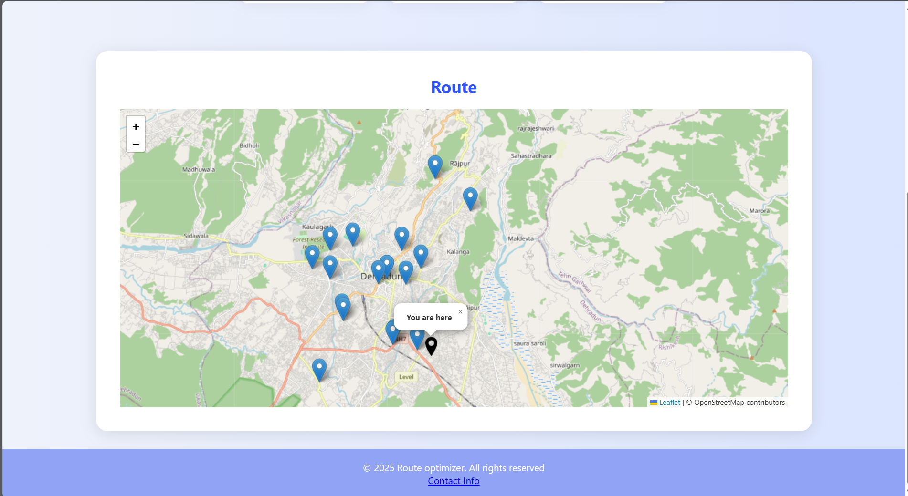
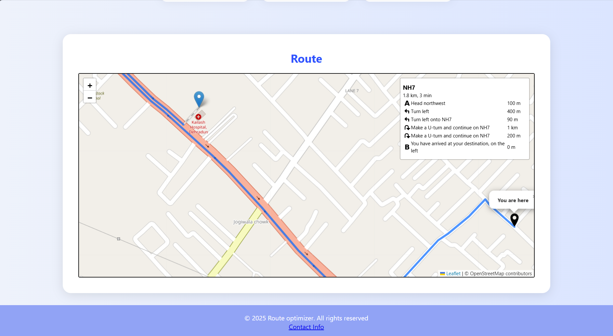
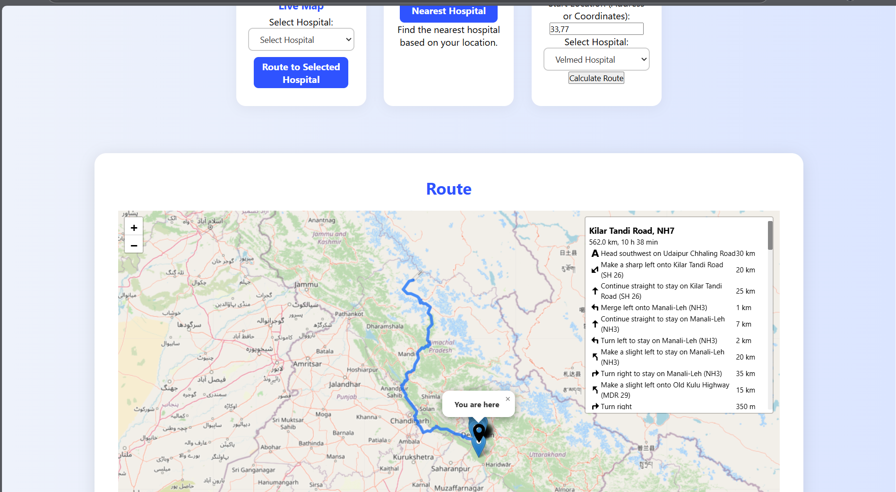

🚑 Ambulance Route Optimization Web App This project is a full-stack web application that helps optimize ambulance routes by identifying the nearest hospital using Dijkstra’s algorithm based on user’s real-time geolocation. It integrates mapping APIs, hospital data, and graph-based pathfinding to assist in emergency decision-making.

**Features**

Real-time user location detection using browser geolocation

Dynamic hospital mapping from a JSON dataset using Leaflet and OpenStreetMap

Distance calculation between coordinates using the Haversine formula

Optimized shortest path finding using Dijkstra’s Algorithm

Visual route suggestion and hospital name display on map

Backend powered by Flask for data processing and API endpoints

**Backend Logic**

Hospital Data Load: Reads a JSON file containing hospital names and coordinates.

Distance Calculation: Uses the Haversine formula to compute real-world distances between hospitals and the user.

Graph Creation: Builds a graph with hospitals as nodes and distances as edge weights.

Dijkstra’s Algorithm: Finds the shortest path from the user's location to the nearest hospital.

API Endpoint: Responds to frontend with the nearest hospital based on calculated path.

**Frontend**

Built with HTML, CSS, JavaScript, and Leaflet.js

Fetches geolocation and sends it to the Flask backend

Visualizes hospitals and nearest path suggestion on an interactive map

**Tech Stack**

Frontend: HTML, CSS, JavaScript, Leaflet.js, OpenStreetMap

Backend: Python, Flask

Algorithms: Haversine Formula, Dijkstra’s Algorithm

Deployment: Localhost (easily deployable on cloud platforms)

**Future Improvements**

Real-time traffic data integration

Live hospital availability and bed status (via API)

Ambulance booking and tracking functionality

User authentication and emergency contact sharing

**Screenshots**

Feature Cards

Demo Map

Demo Route

Third Party

Thanks & Regards,
Dhruv Verma
